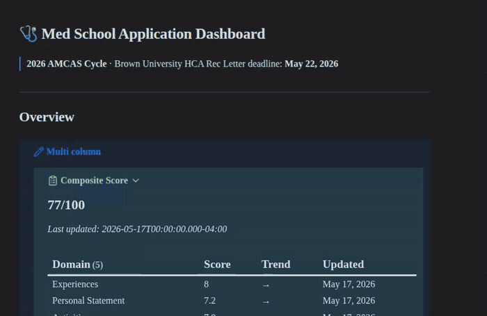

# AMCAS Med School Application Review Agent

A Claude Code– or Codex-powered AI agent that lives inside an Obsidian vault folder and helps you evaluate every component of your AMCAS medical school application. Scores your personal statement, activities, impactful experience essay, and rec letters against rubrics; tracks a composite score over time; and maintains a live Obsidian dashboard via Dataview queries.

> **Note:** This is a personal tool shared as-is, with personal application materials stripped — originally built for one applicant's 2026 AMCAS cycle. It will be generalized and polished for broader use in the future. Setup for a new user takes ~10 minutes with Claude Code's help; see [Setup](#setup) below.

---

## What this is — and isn't

This tool does not replace human feedback, advising, or mentorship, and it does **not complete any part of your application for you**. Your essays, experiences, and story remain entirely your own.

What it offers is a structured, holistic review of your application to help you identify where to focus your efforts. It aims to show how your materials may appear to someone unfamiliar with you, allowing you to decide where revision is most valuable before you submit.

**On authenticity:** The scores and feedback are grounded in what you have actually done — your real hours, your real contributions, your real experiences. The goal is to help you describe these experiences clearly and meaningfully, not to exaggerate or misrepresent them. A well-described, genuine experience will always be more effective than a vague or overstated one.

**On weak areas:** Every applicant has them. If something scores low, that is useful information, not a verdict. By the time you're applying, it's too late to change what you did; what you can change is how clearly and honestly you communicate them. This tool is designed to help with exactly that. Strengths and areas for improvement differ for every strong applicant. The goal is to understand your profile clearly so you can present it with confidence.

**On the bigger picture:** Professional admissions consulting, including application review, essay coaching, and strategic advising, can cost thousands of dollars and is often out of reach for many applicants. This project aims to make structured, rubric-based feedback more accessible. The goal is to support the admissions process by helping applicants without formal advising resources understand their position and present their strongest application. Admissions committees seek strong candidates, and this tool helps more applicants tell their story effectively.

---

## Example



---

## Features

- **Composite scoring** — weighted 0–100 score across 5 domains (Experiences, Personal Statement, Activities, Competency Coverage, Narrative Coherence)
- **17 AAMC competency heatmap** — tracks every core competency with evidence sources
- **Three scoring modes** — Quick Score (one pass), Deep Score (interactive with reasoning), Per-Entry Activities scoring
- **Meeting to-do extraction** — drop a meeting note or transcript, the agent extracts action items automatically
- **Rec letter review** — scored against a 5-section rubric (Brown HCA format, adaptable)
- **Transcript mapping** — maps coursework to AAMC science competencies
- **Live Obsidian dashboard** — auto-updates after every scoring session via Dataview queries
- **School list tracker** — per-school status tracking (see note below)

---

## ⚠️ Current Development Status

| Feature | Status |
|---|---|
| Scoring agent (PS, Activities, IE, Experiences, Competency Coverage) | ✅ Working |
| Composite scorecard + dashboard | ✅ Working |
| Meeting to-do extraction | ✅ Working |
| Rec letter review | ✅ Working |
| Transcript mapping | ✅ Working |
| School list tracker | ⚠️ **Not well-built yet** — basic per-school status files exist but the tracker lacks filtering, sorting, and dashboard integration. MSAR data import is also incomplete. Use as a manual tracker for now. |
| Secondaries | 🔲 Not built — folder placeholder only |

---
**I am planning to build the secondaries section in early June, after I submit my primaries, stay tuned!** 

## Dependencies

You need all of these before setup:

### Required

| Dependency | What it is | Install |
|---|---|---|
| **Obsidian** | Note-taking app the dashboard and agent files live in | [obsidian.md](https://obsidian.md) — free |
| **Dataview plugin** | Obsidian plugin that powers the live dashboard queries | Obsidian → Settings → Community Plugins → search "Dataview" → Install → Enable. Then: Settings → Dataview → turn on **Enable DataviewJS queries** |
| **Claude Code** or **Codex** | The agent runtime — either works. Claude Code reads `Agent/CLAUDE.md` automatically; Codex reads `AGENTS.md` (rename or symlink the file). | Claude Code: [claude.ai/code](https://claude.ai/code). Codex: [openai.com/codex](https://openai.com/codex). Both require an account with the respective provider. |

---

## Setup

### 1. Drop the folder into your Obsidian vault

Copy this folder into your Obsidian vault. It does not need to be at the root — it works from any location inside your vault.

### 2. Open the dashboard

Open `Application Dashboard.md` in Obsidian (Reading mode). If Dataview is installed and DataviewJS is enabled, the panels will render. If you see raw code blocks, check the Dataview setup in Dependencies above.

### 3. Open the agent

**Claude Code:**
```bash
cd "/path/to/your/vault/Med School Application Dashboard"
claude
```
Claude Code reads `Agent/CLAUDE.md` automatically — no further configuration needed.

**Codex:**
Codex reads `AGENTS.md` instead of `CLAUDE.md`. Before your first session, copy or symlink the file:
```bash
cd "/path/to/your/vault/Med School Application Dashboard"
cp Agent/CLAUDE.md AGENTS.md   # or: ln -s Agent/CLAUDE.md AGENTS.md
codex
```

### 4. Paste in your writing

| What | Where |
|---|---|
| Personal statement | `Personal Statement/Personal Statement Draft.md` |
| Activity descriptions | `Activities/Activities Master.md` |
| Impactful experience essay | `Impactful Experience/Impactful Experience Draft.md` |
| Rec letter draft | `Rec Letters/[Recommender Name].md` (copy `_template.md`) |
| Course list | `Transcript/Courses.md` |

### 5. First session

Tell the agent your metrics, then run quick scores:

```
"My GPA is X, BCPM is X, MCAT is X (C/P X, CARS X, B/B X, P/S X)"
"Assess my metrics"
"Quick score my personal statement"
"Quick score activities"
"Quick score impactful experience"
"Score my competency coverage"
```

The dashboard populates automatically after each command.

---

## Personalizing for your system

The `Agent/CLAUDE.md` file addresses the agent as a specific person's reviewer (the original author). Before your first session, open it and update:

- The applicant's name (line 1: `"You are [Name]'s med school application review agent"`)
- University and cycle year
- Any hard deadlines specific to your recommenders or pre-med committee

Everything else (rubrics, scoring logic, dashboard queries) is generic and works without changes.

---

## For LLMs (Claude Code, etc.)

If a user has cloned this repo and asked you to set it up for their system, do the following in order:

1. Ask for their name, university, AMCAS cycle year, and any known hard deadlines (rec letters, primary submission target)
2. Update the first paragraph of `Agent/CLAUDE.md` with their details
3. Ask if they have Obsidian and Dataview installed — if not, give them the install steps from the Dependencies table above
4. Ask where in their vault they want to put the folder, then give them the `cd` command to open the agent
5. Ask them to paste their writing into the draft files, then walk them through the First Session commands above
6. If they want to use the school list tracker, note the current development status — it's manual-only for now

---

## Rubric Sources

The scoring rubrics in `Agent/rubrics/` were built from the following primary sources:

| Rubric | Source |
|---|---|
| **Personal Statement** | AAMC guidance on the Personal Comments essay (character limits, stated intent); adcom evaluation conventions for specificity, reflection, motivation, voice, and narrative arc |
| **Activities** | AMCAS Work/Activities section spec (2026 Application Workbook) — 15-entry limit, 700-char descriptions, 1,325-char Most Meaningful; 20 official AMCAS experience type categories; AAMC's three official criteria for meaningful experiences: *transformative nature, impact made, personal growth* |
| **AAMC Competencies** | The 17 AAMC Core Competencies for Entering Medical Students (published by the AAMC) — split into Professional Competencies and Thinking and Reasoning Competencies |
| **Experiences** | AMCAS Application Workbook (2026), p. 26 — the three official AAMC criteria for meaningful experiences; sub-dimensions (Research Depth, Clinical Depth, etc.) are agent-defined based on adcom evaluation conventions, not AAMC-sourced |
| **Narrative Coherence** | Agent-defined domain — not derived from a single AAMC source. Built around adcom norms for through-line, differentiation, and application-level red flags |

---

## Folder Structure

```
Med School Application Dashboard/
├── Agent/
│   ├── CLAUDE.md                      ← agent instructions (edit for your name/details)
│   ├── scorecard.md                   ← composite + domain scores (agent-maintained)
│   ├── competency-coverage.md         ← 17 AAMC competency scores
│   ├── red-flags.md                   ← active issues log
│   ├── improvement-priorities.md      ← top leverage actions
│   ├── experiences-scores.md          ← experiences domain scores
│   ├── meeting-todos.md               ← extracted action items
│   └── rubrics/                       ← scoring rubrics (do not edit)
├── Application Dashboard.md           ← Obsidian hub (do not edit manually)
├── Usage Guide.md                     ← full command reference
├── Personal Statement/
├── Activities/
├── Impactful Experience/
├── Rec Letters/
├── Meeting Notes/                     ← drop meeting notes here
├── Transcript/
├── School List/                       ← ⚠️ partially built, see status table
└── Secondaries/                       ← 🔲 not yet built
```

---

## Usage Guide

See `Usage Guide.md` for the full command reference, scoring scale, and workflow recommendations.
